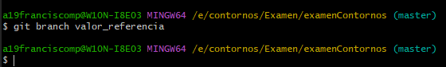
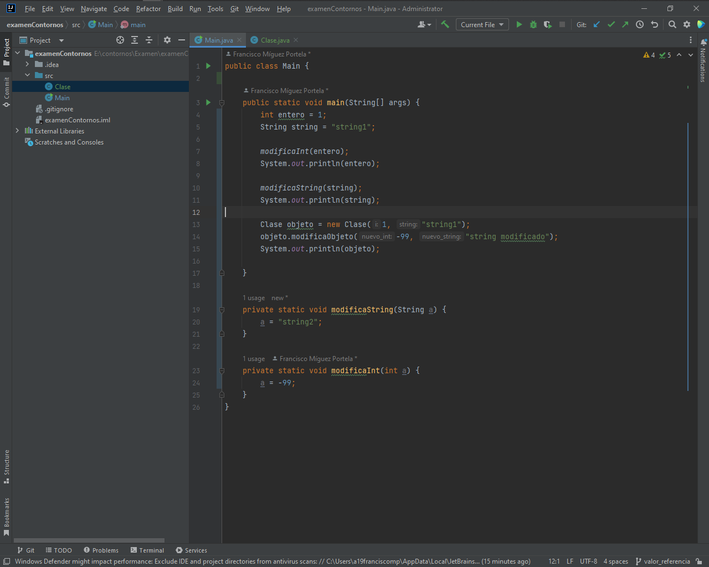

# 1. Creamos un proyecto con repositorio Git y código de ejemplo.

# 2. Primer commit en master.
Para realizar este paso, vamos a la carpeta del repositorio de git y abrimos git bash.

Como podemos observar, ya tiene el repositorio de Git creado y estamos en "Master".

Antes de realizar el primer commit, vamos a añadir los archivos que queremos de ese directorio, en este caso, todos, con el comando "git add ."

Escribimos el primer commit poniendo "proyecto base" con el commando "git commit -m " " ".

# 3. Creamos y resarrollamos la rama valor_referencia.
Para poder realizar esto, primero, debemos crear la rama con el comando " git branch".

Una vez creada, debemos movernos a esa rama con el comando "git checkout".

a)Nos vamos a Main y modificamos el codigo.

b)Creamos la clase Clase y añadimos el codigo.

c)Añadimos nuevamente todo lo del directorio y commiteamos escribiendo "probando paso por valor y referencia".

d)Modificamos nuevamente el codigo de Main y Clase, corriendolo y mejorandolo.

Main:

Clase:

e)Añadimos nuevamente todo lo del directorio y commiteamos escrbiendo "corrigido y mejorado".

f)Nos vamos a GitHub y creamos un repositorio vacio.

Añadimos el remote de github con el commando "git remote add origin https://github.com/Tech-F/ed-examen-git-1t.git".

# 4. Hacemos un push de la rama valor_referencia.
Comando necesario "git push --set-upstream origin valor_referencia"

# 5. Ahora debemos hacer un merge de esta rama a master.
Comando necesario "git merge valor_referencia master"

# 6. Creamos una rama paso_arrays y la desarrollamos.
Primero hacemos un comando branch para crear y la rama y luego un checkout para entrar en ella.

a) modificamos el archivo Main con el nuevo código.

b) añadimos archivos del directorio y commiteamos escribiendo "pasando arrays".

# 7. Hacemos un merge de la rama paso_arrays a master.

# 8. Creamos las ramas comparando_objetos y comparando_strings y las desarrollamos.
a)Primero creamos comparando_objetos y la desarrollamos:

a.1)Creamos una clase llamada "CompareWithEquals.java" y añadimos el código.

a.2)Añadimos los archivos del directorio y commiteamos escribiendo "ejemplos de uso de equals con objetos".

b)Volvemos al la rama paso_arrays con el comando "git checkout paso_arrays y creamos la nueva rama comparando_strings".

b.1)Creamos la clase java "CompareWithEquals.java" y añadimos el codigo.

b.2)Añadimos todos los archivos del directorio y commiteamos con "probando equals con strings".

b.3)Ahora hacemos merge de la rama a Master.

# 9.Hacemos merge de ambas a master, solventando conflicto.

Objetos:

Strings:

Ahora volvemos a master

modificamos el codigo de CompareWithEquals.java y commiteamos con el siguiente texto "merge de comparando_strings solventando conflicto".

**No me dio tiempo a más. Espero que esté correcto hasta aquí**

Estaba haciendo el merge al reves todo el tiempo.

Lo corrijo para poder subirlo correctamente.

